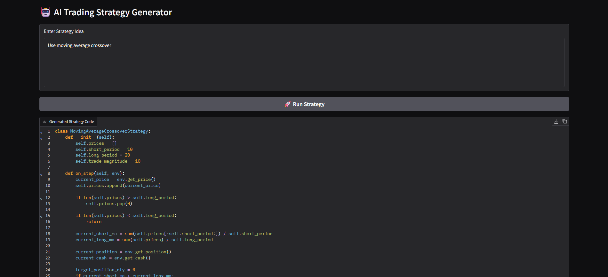
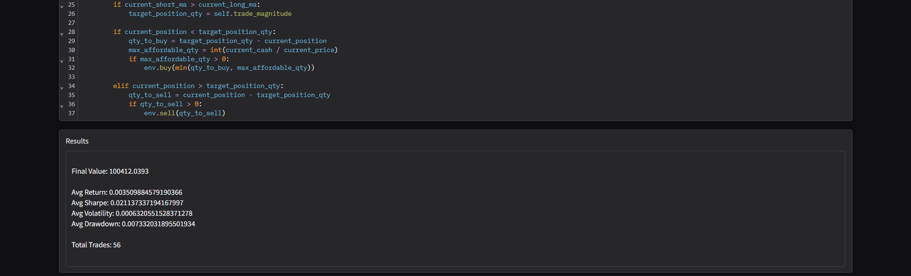
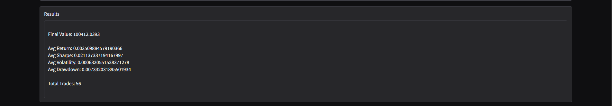
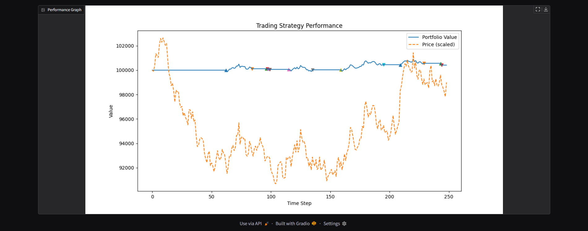

# 🤖 AI Trading Strategy Generator

An AI-powered system that generates, evaluates, and optimizes trading strategies using Large Language Models (LLMs) in a simulated market environment.

---

## 🚀 Features

- 🧠 LLM-based trading strategy generation (Gemini)
- 📊 Backtesting engine with portfolio simulation
- 🔁 Multi-dataset evaluation (Reliance, TCS, HDFC)
- 💸 Transaction cost modeling (realistic trading)
- 📈 Performance metrics:
  - Total Return
  - Sharpe Ratio
  - Volatility
  - Max Drawdown
- 🖥️ Interactive UI using Gradio

---

## 🧠 How It Works

1. User inputs a trading idea (e.g., moving average crossover)
2. LLM generates a Python strategy
3. Strategy is executed in a simulated trading environment
4. Backtester evaluates performance
5. Best strategy is selected and visualized

---

## 📊 Sample Outputs
Final Value: 102965.02

---

### 📌 Performance Metrics

Avg Return: 0.00823

Avg Sharpe: 0.01666

Avg Volatility: 0.00452

Avg Drawdown: 0.07100

Total Trades: 54

---


---

### 📈 Strategy Performance Graph


  
  


---

## 🗂️ Project Structure

```text
TradingAI/
├── asset/             # Output graphs
├── backtester/        # Backtesting logic
├── data/              # Dataset CSV files
├── env/               # Trading environment
├── executor/          # Strategy execution
├── llm/               # LLM integration
├── loop/              # Optimization loop
├── metrics/           # Performance metrics
├── strategies/        # Strategy templates
├── ui/                # Gradio UI
│
├── main.py            # CLI entry
├── best_strategy.py   # Saved best strategy
├── results.json       # Output results
└── requirements.txt
```


---

## ⚙️ Installation

```bash
pip install -r requirements.txt
```

---

## ▶️ Run the Project

Run UI (recommended)

-python -m ui.app

Run CLI version

-python main.py

---

## 🧠 Tech Stack

Python

Gradio

Pandas, NumPy, Matplotlib

LLM API (Gemini)

---

## ⚠️ Disclaimer

This project is for educational purposes only.
It simulates trading strategies and does not provide financial advice.

---

## ⭐ Key Highlights

Combines AI + Finance + System Design

Introduces real-world constraints (transaction cost)

Demonstrates end-to-end ML system thinking

---
